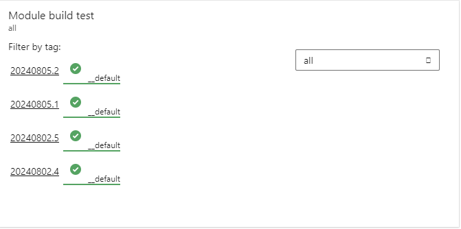
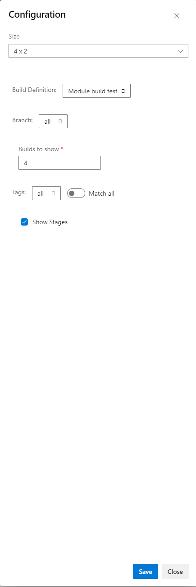

# Azure DevOps pipeline overview

## For Azure DevOps Server users

Currently, this widget is only compatible with Azure DevOps server 2022.2 due to api-version changes in the azure devops extension library.

This issue will be fixed in all versions above or equal to 2.1.0.0 . However, until then, old and new installations of the widget are expected to not work on versions of Azure DevOps server at 2022.1 patch x and lower.

## How it works

This widget allows you to display the various builds executed on a specific pipeline for one branch.

You can also filter them by tags to further reduce the scope of the widget and track your release more precisely.

## Configuration

You can configure the following properties of your widget:
- Size: You can increase or reduce the size of your widget to adapt it to the amount of builds or stage you are displaying
- Build definition: You can choose which build definition inside your `Pipelines` blade to use for the widget
- Branch: You can choose a specific branch to monitor with your build
- Builds to show: You can specify how many builds you want to display
- Tags: Filter your builds to only display builds tagged with a specific keyword.
- Match any/all: Select if the tags selected should be matched all at once or any of them.
- Show Stages: Allows you to only show the overall result of the build or a breakdown stage by stage.

## How you can help to improve this widget

As you can see, while this widget works for simple, linear builds. It is principally focused on release management
making use of a single branch per dashboard.

As such, here is a small list of improvements we would like to implement, and you could help us improve on

### Support for multiple branch filtering

Right now, this widget can only filter by a single branch. It would be better to be able to filter either:
- A multi-selection of many branches

### Support for multi-stage display

Sometimes, you can have multiple stage that depends on a single stage and run in parallel. This widget has no way of
displaying this currently. This would likely be implemented through a third party graph library.

### Better UI

Regardless of the previous points. The UI is "Bare bone" and could be heavily improved.
